Machine Learning creates a function that maps an input to an output. With deep learning, we can use a wide variety of data as input into this function, including tabular data, text, images, audio, and video. In addition, deep learning can map these inputs to a variety of outputs, including once again, tabular data, text, images, audio, and video. We're going to cover a few of the key deep learning applications that currently exist today, and some future applications that are just around the corner.

### Tables
Let's start simple by looking at applications that use tabular data as both input and output. Tabular data are categorical and numeric values stored in columns and rows of the table. There are roughly four general categories of tasks that we can perform on tabular data with deep learning.

1. **Classification** is where we attempt to make a decision or a prediction involving two or more categories or outcomes. For example, deciding whether to accept or reject a loan based on data from a customer's financial history. 
2. **Regression** is where we attempt to predict a numeric outcome based on one or more input variables. For example, trying to predict the sale price of a house based on the features of the house compared to the sale price of similar houses.
3. **Clustering** is where we attempt to group similar objects together based on similarities in their data. For example, grouping customers into marketing segments based on their income, age, gender, number of children, etc.
4. **Anomaly Detection** is where we find observations in the data that are different from the normal data. For example, detecting an unusual spike in the number of negative comments about a product that we've just released.

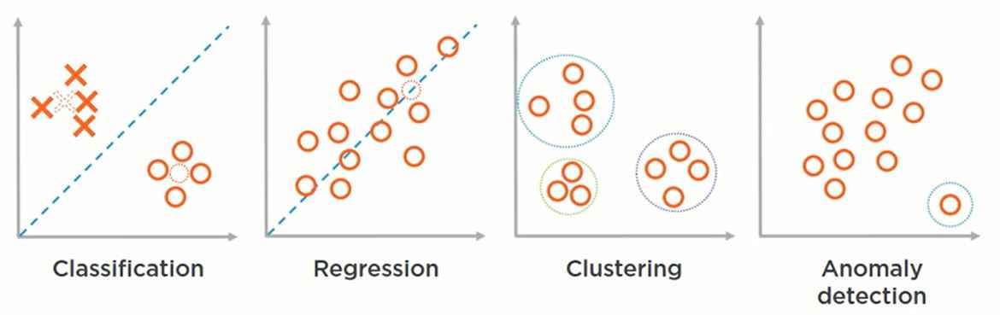

While all four of these tasks can be performed on tabular data using deep neural networks, oftentimes deep learning is overkill for these types of tasks. This is typically the case when the tabular dataset is small, or the function we are attempting to model is relatively simple. These types of problems are generally solved more effectively using traditional machine learning tools, for example,decision tree classifiers, support vector machines, k-means clustering, or shallow, rather than deep neural networks.

However, there are cases where the tabular datasets are large enough, and the function that we are attempting to model is complex enough that a deep neural network makes sense. For example, Stanford University announced that it had created a deep neural network to predict whether patients admitted to a hospital will die within the next year or not. The deep neural network was able to predict patient mortality with approximately 90% accuracy. This training algorithm used over 13,000 columns and over 220,000 rows of tabular data as input in order to reach this level of prediction accuracy.

### Text
Now let's learn about deep learning applications for textual data; that is, bodies of text contained in documents. With deep learning, we can map the text and the document as an input to a variety of outputs. 

**Examples**:

we can perform **document classification**. This is where we attempt to predict which category a document belongs to. i.e, predicting whether the topic of a news article is technology, sports, or entertainment.

**Natural language processing** has also received tremendous benefits from deep learning as well. For example, deep neural networks can now understand the grammar, syntax, and meaning of sentences.
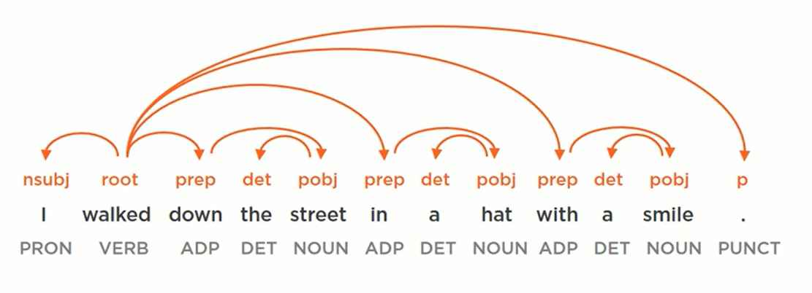

**Sentiment analysis** is where we take a body of text as input, and determine the author's emotions behind the words. In the example below, we can see words and phrases that either have a positive sentiment in blue, neutral sentiment in gray, or a negative sentiment in red.
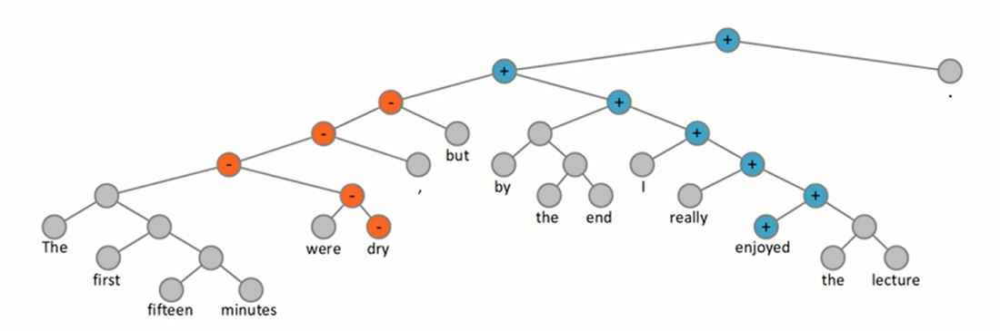

We can also use deep learning to generate text as an output from a variety of inputs as well. For example, in the last module, we saw how recurrent neural networks can be used to predict the next letter someone is about to type based on the previous letters that they've already typed. However, we can also use recurrent neural networks to predict which word someone is likely to type based on all of the other words that they've previously typed.
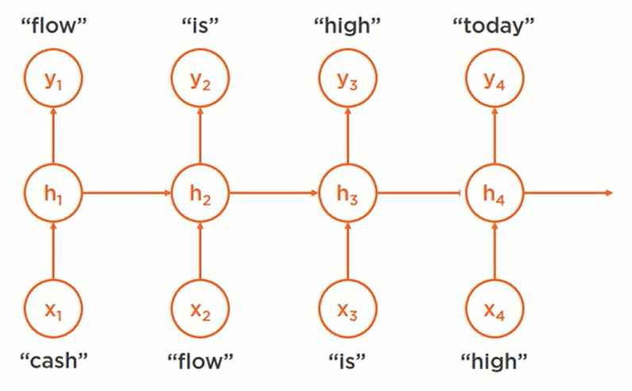

In addition, we can also use recurrent neural networks for **language translation**. This is where we translate words and phrases from one language into another language. You may have noticed how much better software based language translation has gotten in recent years. This is all thanks to advances in deep recurrent neural networks. 

We can train a recurrent neural network to **generate headlines** and summaries for bodies of text based on the content of the document. The computer generated headlines you see here are almost indistinguishable from the headlines that a human would create to summarize a story.

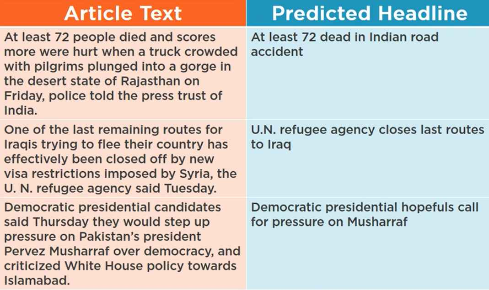

### Images
With deep learning, we can map images as an input to a variety of outputs.
For example:

- we can perform tasks like object recognition where we detect and provide labels for objects in an image.
- Gender classification, where we determine the gender of a subject in an image.
- Age regression, where we predict how old a person is in a photo.
- Emotion detection, where we predict the emotional state portrayed on a person's face.

We can also perform more advanced image analysis tasks by combining a convolutional neural network with a deconvolutional neural network, an architecture known as a **convolutional encoder decoder**. This allows us to perform tasks like pixel wise image segmentation, where we extract pixels corresponding to specific objects in an image. For example, all of the pixels of the car in the center of this image have been color coded yellow.
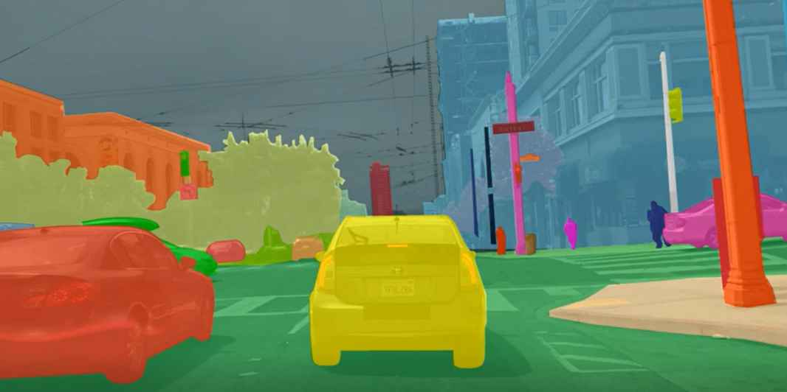

We can also combine a CNN and an RNN to perform **image captioning**. Image captioning is where we generate a description of what is happening in an image. As you can see from these three examples, the deep learning algorithm is able to provide a caption to each image that is almost indistinguishable from the caption a human would provide.
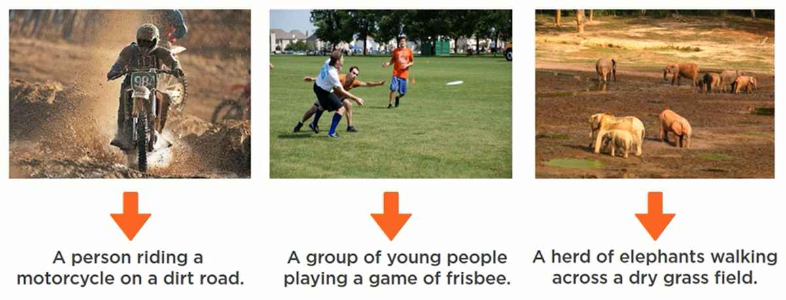

However, we can also use deep learning to generate images as an output using a variety of different types of input. For example, super resolution convolutional neural networks have been applied to images to attempt to enhance their image resolution. As we can see, given an 8x8 array of pixels, the CNN is able to produce a 32x32 image that closely approximates the true image. 
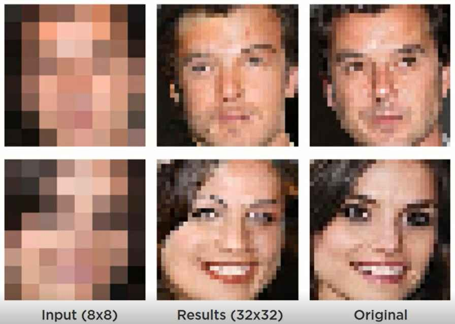

We can also use generative adversarial networks to clean up the noise in an image as well. In fact, entire sections of this image can be missing, and the GAN will fill in the missing pixels, given the information surrounding the missing section. 
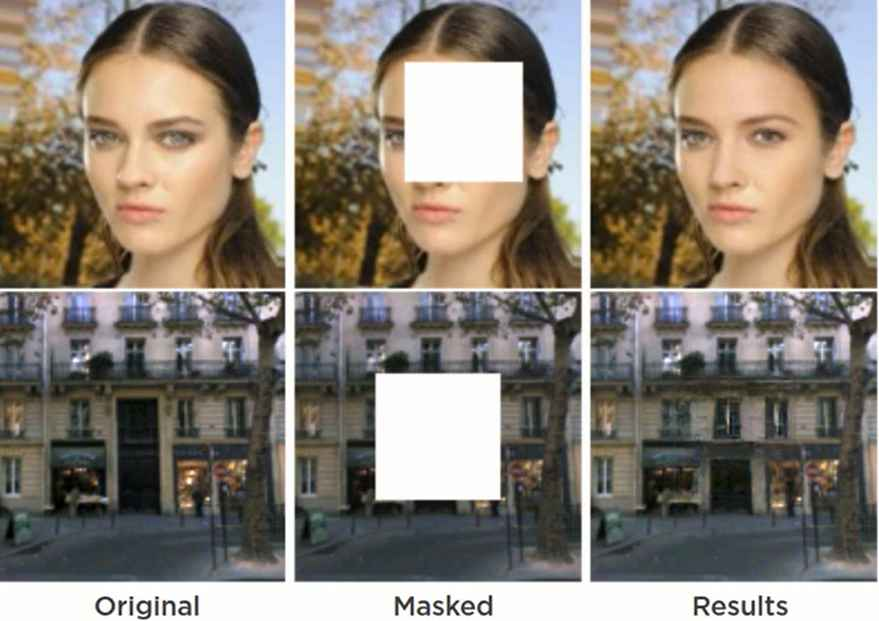

We can also use generative adversarial networks to modify existing images with new predictions. For example, we can take an image of yours truly and use a GAN to generate a prediction of what I'll look like in 20 years. In fact, this deep learning application is so good that it tricked the age detection algorithms into thinking that I was exactly 20 years older.

We can also use deep learning to generate entirely new images from scratch. And how about these fake celebrities? Each of these images was created by a generative adversarial network. They may feel like real celebrities since the GAN was trained using more than 200,000 high-resolution images of real celebrities; however, not a single one of these synthetic celebrities is a real person.
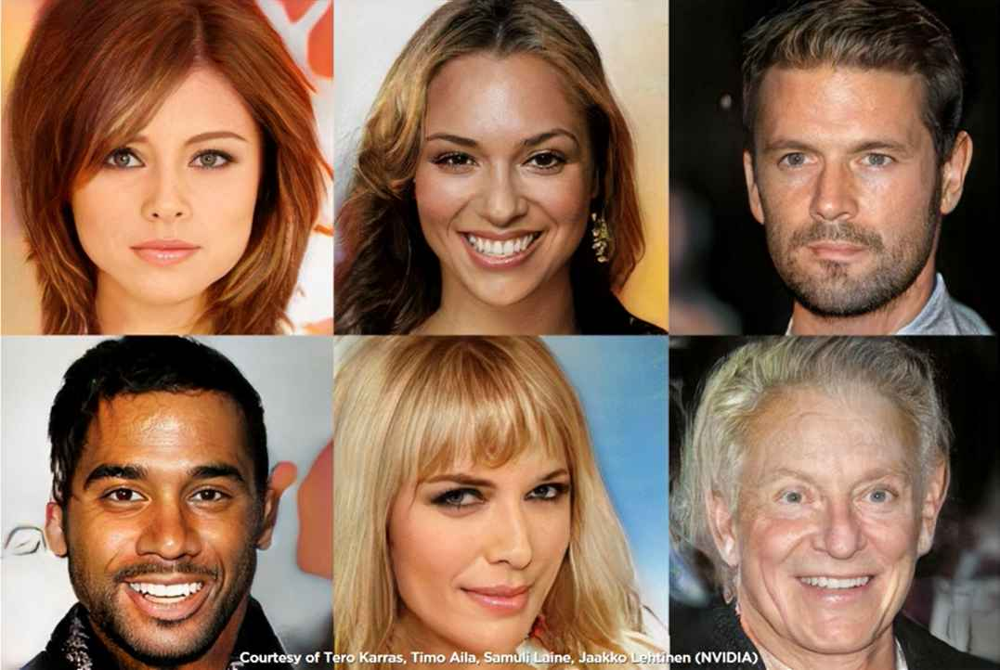

(Working) Finally, we're rapidly nearing a point in time where we can synthesize new images based on a description of what we want the image to look like. For example, all of these images were generated by a generative adversarial network using the descriptions above. It won't be long before we can just tell a computer what kind of image we need for our document or presentation, and it will synthesize an entirely new image to match our description.
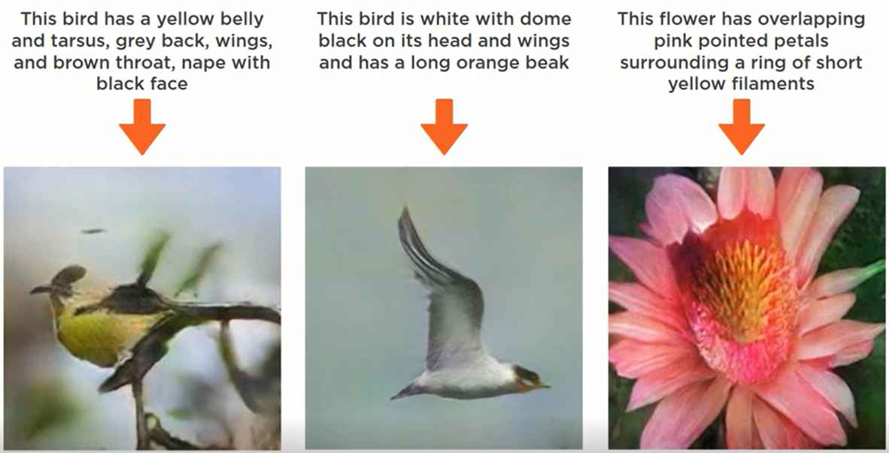

### Audio
With deep learning, we can map audio as an input to a wide variety of outputs. 

For example, we can use combinations of CNNs and RNNs to classify the source of a sound. This allows computers to recognize the song that you're listening to based on the music it's hearing. It also allows computers to recognize animals, vehicles, and environmental noises by sound alone. 

In addition, we can also use combinations of CNNs and RNNs to perform speech to text translation at near human level accuracy. If you've noticed how much better your smart phone has gotten at interpreting your commands in the past few years, once again, you can thank deep learning for the recent improvements.

We can also use combinations of CNN and RNN encoder/decoder networks to perform real-time speech translation. For example, I can speak a sentence in one language, and in near real-time, the listener will hear what I said in their native language. 

But we can also use deep learning to generate audio as an output, given a variety of inputs. For example, using a type of deep neural network architecture known as a dilated causal convolutional neural network, we can have deep learning speech synthesis that sounds almost indistinguishable from actual human speech. 

Finally, here's an experimental application that's currently in development by Princeton University and Adobe. It allows you to feed in your audio recordings, it converts your audio into a transcript, and then it allows you to edit the text just like a text editor. Then after you've made your changes to the text, it synthesizes new audio that sounds almost identical to your own voice. While this specific application might be a few years away yet.

### Video
With deep learning, we can map video as an input to a variety of types of outputs. For example, Tasks like object detection, where we classify an object as it's moving from frame to frame; facial recognition, where we recognize a person's face in a moving video; and outcome prediction, where we analyze a few frames of vide to attempt to predict what will happen next. Plus, this is also leading to entirely new applications like real-time sign language translation and computer-based lip reading. In fact, real-time sign language translation is rapidly approaching human level proficiency, and Google's LipNet is currently better than the average human lip reader.

However, even more impressive is that we can now use deep learning to generate video as an output from a variety of inputs. For example, using a combination of convolutional encoder/decoder networks, we can now teach a computer to automatically colorize black and white videos. In addition, machines are also being taught to restore old or damaged films as well. And check this out. To help families refinance their homes. To invest in things like high-tech manufacturing, clean energy, and the infrastructure that creates good new jobs. You can see why it's so important that people understand the potential applications for deep learning before someone tries to use deep learning to deceive others for nefarious purposes.

### Future
Finally, let's look at other future deep learning applications beyond the basic input to output mappings that we've already seen. It's important to note that what we've seen so far is just the beginning of deep learning technologies. Deep learning can be applied to a variety of other inputs, and produce a variety of other outputs. Plus, we can combine multiple types of inputs and produce multiple types of outputs as well. This leads to a whole new realm of possible applications for deep learning in the future.

For example, self-driving cars connect a variety of sensor inputs with a set of vehicle control outputs to drive an automobile without any human intervention. This same deep learning technology can also be applied to other types of vehicles like semis, buses, boats, airplanes and drones as well.