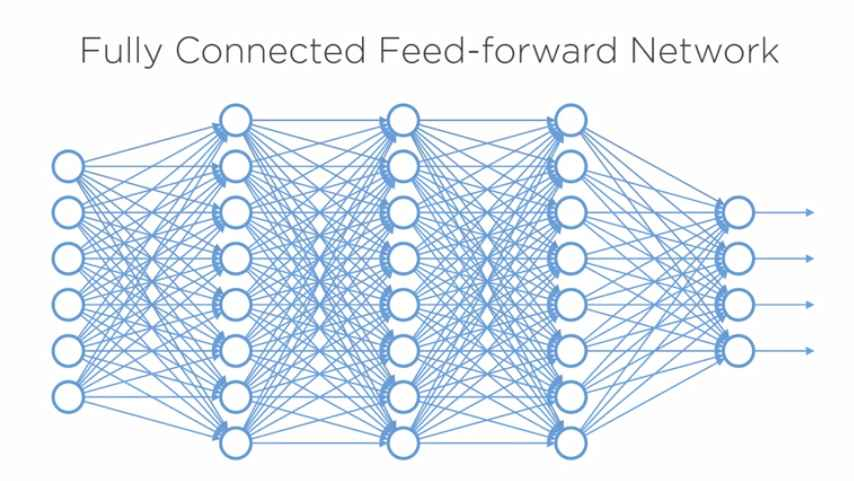
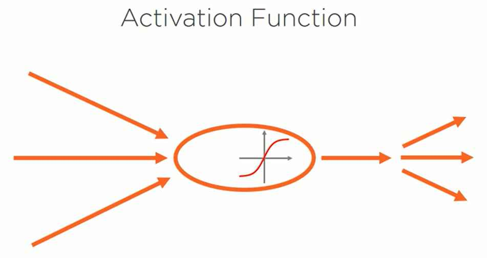
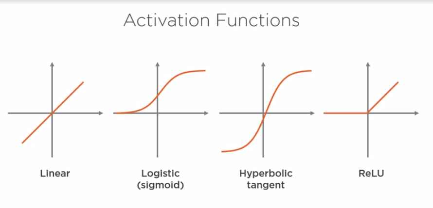
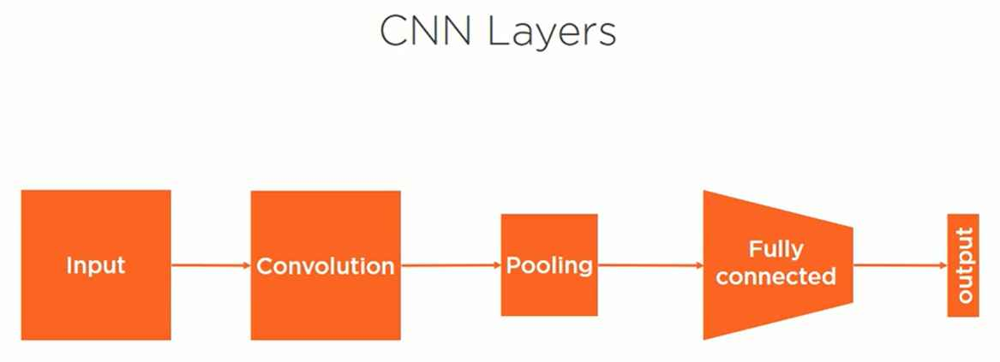
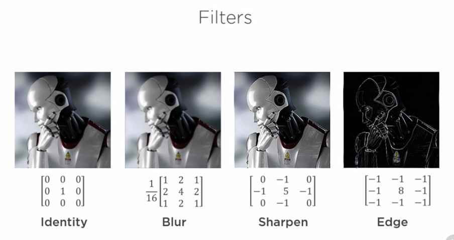
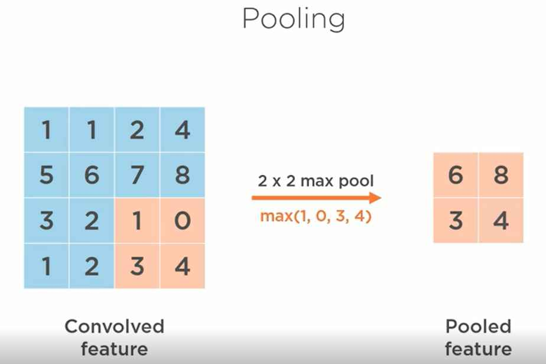
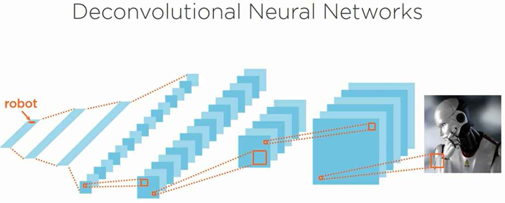
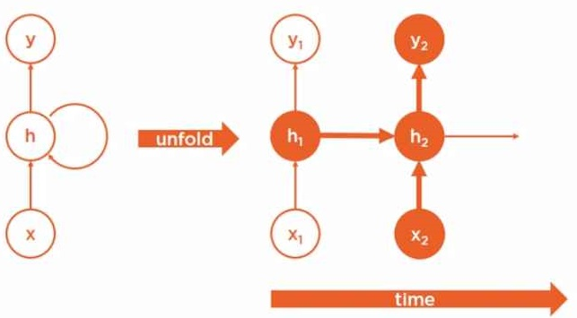
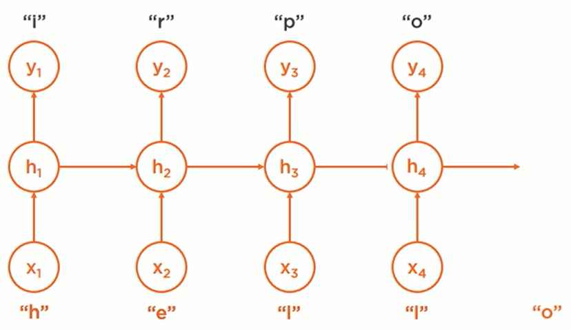
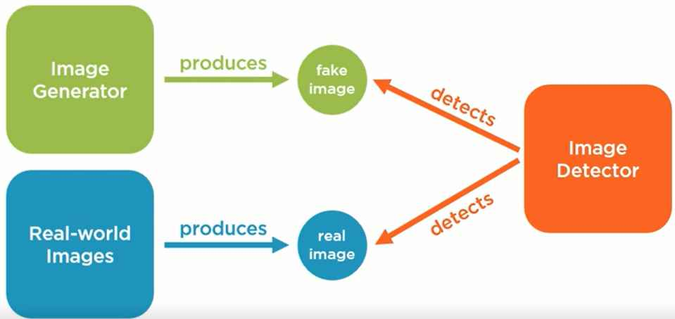

### Deep Learning
Deep Learning is a form of artificial intelligence that uses a type of machine learning called an artificial neural network with multiple hidden layers that learns hierarchical representations of the underlying data in order to make predictions given new data.

### Artificial Intelligence
AI is a field of computer science that attempts to create machines that act rationally in response to their environment.

- Explicit Programming
- Encoding Domain Knowledge
- Statistical Patterns Detection

### Machine Learning
ML is a type of artificial intelligence where we teach machines how to solve problems without explicitly programming then to do so.

### Artificial Neural Network
It is a machine learning algorihtm based on a very crude approximation of biological neural network in a brain. If we connect a series of artificial neurons in a network, we get an artificial neural network or neural network.

- **Forward Propagation:** we use the network with its current parameters to compute a prediction for each example in our training dataset. We use the known correct answer that a human provided to determine if the network made a correct prediction or not. An incorrected prediction, which we refer to as a prediction error, will be used to teach the network to change the weights of its connections to avoid making prediction errors in the future.
- **Backward Propagation:** we use the prediction error that we computed in the last step to properly update the weights of the connections between each neuron to help the network make better future prediction. We use a technique called **gradient descent** to help us decide whether to increase or decrease each individual connection's weights, Training Rate is used to determine how much to increase or decrease the weights during each training step. We repeat this process for each training sample in the training dataset, and then we repeat the whole many times until the weights of the network become stable.

### Deep Neural Networks
It is a neural network with more than one hidden layer.

### Techniques
Which allow deep learning to solve a variety of problems:

- Fully Connected Networks
- Convolutional Networks
- Recurrent Networks
- Generative Adversarial Networks
- Deep Reinforcement Learning

### Fully Connected Neural Networks
By fully connected, we mean that each neuron in the preceding layer is connected to every neuron in the subsequent layer. By feedforward, we mean that neurons in any preceding layer are only ever connected to the neurons in a subsequent layer. That is, there are no cycles or loops in the connections of the graph of neurons.

 As we mentioned in the previous module, each neuron in a neural network contains an **activation function** that changes the output of a neuron given its input. We have several types of activation functions that can change this input to output relationship to make a neuron behave in a variety of ways. 
 
 
 
 Some of the most well-known activation functions:
 
- **linear function**, straight line that essentially multiplies the input by a constant value
- **sigmoid function**, s-shaped curve ranging from 0 to 1
- **hyperbolic tangent** or **tanH function**, s-shaped curve ranging from -1 to +1
- **rectified linear unit** or **ReLU function**, a piecewise function that outputs a 0 if the input is less than a certain value, or linear multiple if the input is greater than a certain value.

The last three activation functions we refer to as non-linear functions because the output is not a linear multiple of the input. Non-linearity is what allows deep neural networks to model complex functions. 

We can create networks with various inputs, various outputs, various hidden layers, various neurons per hidden layer, and a variety of activation functions. These numerous combinations allow us to create a variety of powerful deep neural networks that can solve a wide array of problems.

The more neurons we add to each hidden layer, the wider the network becomes. In addition, the more hidden layers we add, the deeper the network becomes. However, each neuron we add increases the complexity and thus the processing power necessary to train a neural network. This increase in complexity isn't linear in the number of neurons we add, which leads to an explosion in complexity and training time for large neural networks. 

As a result, there are certain non-fully connected neural network architectures called **sparse neural networks** that allow us to create deep neural networks without paying the high cost of a large fully connected network.

### Convolutional Neural Networks(CNN)
CNN is a type of deep neural network architecture designed for specific tasks like image classification. CNNs were inspired by the organization of neurons in the visual cortex of the animal brain. As a result, they provide some very interesting features that are useful for processing certain types of data; like images, audio, and video.

1. A CNN is composed of an **input layer**. However, for basic image processing, this input is typically a two-dimensional array of neurons which correspond to the pixels of an image. So, we'll represent this layer visually as a square instead of a set of circles.
2. A CNN also contains an **output layer** which is typically a one-dimensional set of output neurons; one neuron for each category of image being classified. So, we'll represent this as a thick, solid line.
3. A CNN also contains one or more **hidden layers**; however, unlike a fully connected neural network, CNNs use a combination of **sparsely connected convolution layers**, which perform image processing on their inputs. 
4. In addition, they contain down sampling layers called **pooling layers** to further reduce the number of neurons necessary in subsequent layers of the network.
5. CNNs typically contain one or more **fully connected layers** to connect our pooling layer to our output layer.

**Convolution** is a technique that allows us to extract visual features from an image in small chunks. Each neuron in a convolution layer is responsible for a small cluster of neurons in the preceding layer. The bounding box that determines the cluster of neurons is called a filter, also known as a **kernel**. Conceptually, you can think of a filter moving across the image and performing a mathematical operation on individual regions of the image. It then sends the result to the corresponding neuron in the convolution layer.

**Filters** mathematically modify the input of a convolution to help it detect certain types of features in the image. They can return the unmodified image, blur the image, sharpen the image, detect edges, and more. This is done by multiplying the original image values by a convolution matrix like the four matrices shown. Filters help a CNN detect certain features in an image by performing these transformations.

**Pooling**, also known as subsampling or down sampling, is the next step in a convolutional neural network. Pooling reduces the number of neurons in the previous convolution layer while still retaining the most important information. There are different types of pooling that can be performed. For example, taking the average of each input neuron, the sum of each neuron, or the maximum value.

**For example**, we're performing what is called a 2x2 max pool with a stride of two. When we put all these techniques together, we get an architecture for a deep neural network quite different from our fully connected neural network. First, we take an input image, which is a two-dimensional matrix, typically with three color channels. Next, we use a convolution layer with multiple filters to create a two-dimensional feature matrix as output for each filter. Then, we pool the results to produce a down sample feature matrix for each filter in the convolution layer. Next, we typically repeat the convolution and pooling steps multiple times using previous features as input. Then, we add a few fully connected hidden layers to help classify the image, and finally, we produce our classification prediction in the output layer.

We can also reverse this architecture to create what is known as a **deconvolutional neural network**. These networks perform the inverse of a convolutional network. Rather than taking an image and converting it into a prediction value, these networks take an input value and attempt to produce an image instead.

CNN work well for a variety of tasks including image recognition, image processing, image segmentation, video analysis, and natural language processing

### Recurrent Neural Networks
All of the neural networks we've seen so far have been feedforward neural networks. They are called this because data flows only from the input x through one or more hidden neurons, h, to the output y. However, we also have several types of neural network architectures that contain feedback loops. Unlike feedforward neural networks, the recurrent neural network, or RNN, can operate effectively on sequences of data with variable input length. 

In order to visualize how an RNN works, let's rotate the path through the RNN from its previous left to right orientation to a top to bottom orientation instead. We're just going to focus on a single path through the network from the input x, through the hidden neuron h, to the output neuron y. Now let's unfold this path through the neural network over time. If we imagine this RNN moving through time this first path represents a network in time step one. The hidden node h1 uses the input x1 to reduce output y1. This is exactly what we've already seen with basic feedforward neural networks. Now let's add a second time step. The hidden node at the current time step, h2, uses both the new input x2, and its state from the previous time step, h1, as input to make its new prediction, y2.

This means that a recurrent neural network uses knowledge of its previous state as an input for its current prediction, and we can repeat this process for an arbitrary number of steps allowing the network to propagate information via its hidden state through time. This is essentially like giving a neural network a **short-term memory**. 

This feature makes RNNs very effective for working with sequences of data that occur over time. For example, time-series data, like changes in stock prices, a sequence of characters, like a stream of characters being typed into a mobile phone, and a sequence of words, like the stream of words contained in the news article.

**For example**, imagine we're creating a recurrent neural network to predict the next letter a person is likely to type based on the previous letters they've already typed. The letter that a user just typed is quite important to predicting the next letter. However, all of the previous letters are also very important to this prediction as well. At the first time step, the user types the letter h, so our network might predict that the next letter is an i based on all of the previous training examples that included the word hi. At the next time step, the user types the letter e, so our network uses both the new letter e plus the state of the first hidden neuron in order to compute our next prediction r. The network predicts this because of the high frequency of occurrences of the word her in our training dataset. Adding the letter l might predict the word help, and adding another l would predict the letter o, which would match the word our user intended to type, which is hello.

RNNs work well for applications that involve a sequence of data that changes over time. These applications include natural language processing, speech recognition, language translation, conversation modeling, image captioning, and visual Q&A.

### Generative Adversarial Networks

The GAN is a combination of two deep learning neural networks: a Generator Network, and a Discriminator Network. The **Generator Network** produces synthetic data, and the **Discriminator Network** tries to detect if the data that it's seeing is real or synthetic. These two networks are adversaries in the sense that they're both competing to beat one another. The Generator is trying to produce synthetic data indistinguishable from real data, and the Discriminator is trying to become progressively better at detecting fake data.

**For example**, imagine we want to create a neural network that generates synthetic images. First, we'd acquire a library of real-world images that we can use to provide real images for the image detector network. Next, we'd create an Image Generator network to produce synthetic images. This would typically be a deconvolutional neural network, which we discussed earlier in this module. Then we'd create an Image Detector network to detect real images versus fake images. This would typically be a convolutional neural network which we also discussed earlier in this module. At first, the generator would essentially create random noise as it learns how to create images that can fool the detector. In addition, the detector would only have roughly 50/50 accuracy when predicting real versus fake images. However, with each training iteration, the generator gets progressively better at generating real images, and the detector gets progressively better at detecting fake images. If you let these networks compete with one another for long enough, the generator begins producing fake images that approximate real images. Generative Adversarial Networks have gained quite a bit of popularity in recent years.

Some of their applications include: image generation, image enhancement, text generation, speech synthesis new drug discovery, and more.

### Deep Reinforcement Learning

Now let's discuss reinforcement learning: our final technique for creating deep neural networks that can solve a variety of problems. Reinforcement learning involves an agent interacting with an environment. The agent is trying to achieve a goal of some kind within the environment. The environment has state, which the agent can observe. The agent has actions that it can take, which modify the state of the environment, and the agent receives reward signals when it achieves a goal of some kind. The objective of the agent is to learn how to interact with its environment in such a way that allows it to achieve its goals.

**For example**, an agent might be a car trying to get its passengers to their destination. The environment would be the world the car is driving in. This would include the road, other cars, pedestrians, and any obstacles on the road. The car can observe the state of its environment; for example, it's position, speed, and direction, the orientation of the road it's driving on, and the location of any obstacles in its path. The car has actions that it can perform to modify the state of the world. For example, the car can accelerate, decelerate, turn left, or turn right. This allows it to change its position relative to the objects in the world. The car would receive reward signals when it achieves a goal of some kind; for example, we could reward the car when it arrives safely at its destination, for each mile it stays on the road, and for each minute it drives at a safe speed. We could also penalize the car when it drives off the road, travels at unsafe speeds, or climbs with an obstacle. The objective for the car is to learn how to drive in this world in such a way that it arrives at its destination.

Deep reinforcement learning is the application of reinforcement learning to train deep neural networks. Like our previous deep neural networks, we have an input layer, an output layer, and multiple hidden layers. However, our input is the state of the environment; for example, position, speed, and direction; our output is a series of a possible actions; for example, speed up, slow down, turn left, or turn right. In addition, we're feeding our rewards signal into the network so that we can learn to associate what actions produce positive results given a specific state of the environment. This deep neural network attempts to predict the expected future reward for each action, given the current state of the environment. It then chooses whichever action's predicted to have the highest potential future reward, and performs that action.

Some examples of Deep Reinforcement Learning Applications are games, including board games like chess and Go, card games like poker, and 8-bit video games. Autonomous vehicles, like self-driving cars, and autonomous drones. Robotics, including teaching robots how to walk, and teaching robots how to perform manual tasks. Management tasks, including inventory management, resource allocation, and logistics; and financial tasks, including investment decisions, portfolio design, and asset pricing.