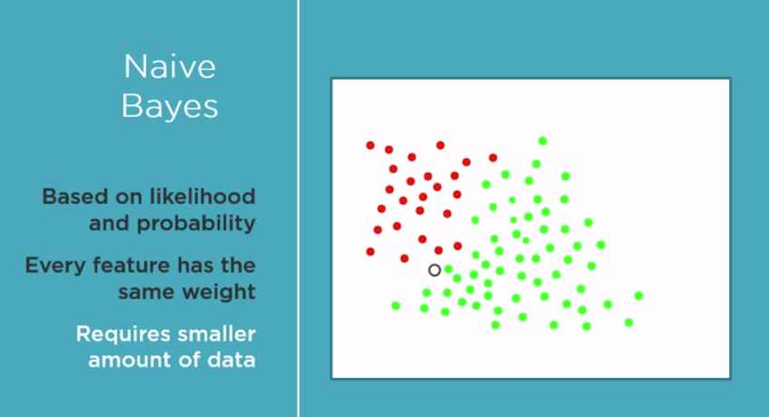
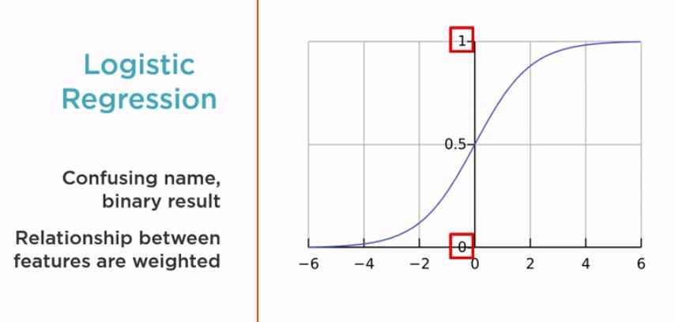
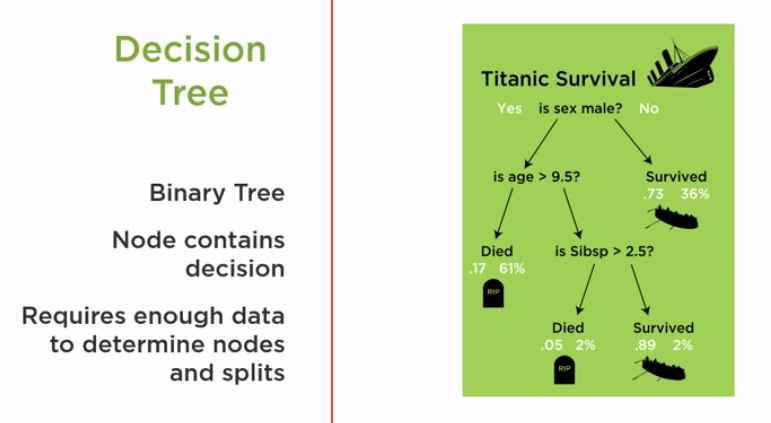
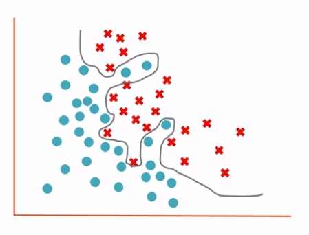

An orchestrated and repeatable pattern which systematically transforms and processes information to create prediction solutions.

- Asking the right question
- Preparing data
- Selecting the algorithm
- Training the model
- Testing the model

### Solution Statement
_Use the Machine Learning Workflow to process and transform Pima Indian data to create a prediction model. This model must predict which peopel are likely to develop diabetes with 70% or greater accuracy_

### Tidy Data
Tidy datasets are easy to manipulate, model and visualize, and have a specific structure:

- each variable is a column
- each observation is a row
- each type of observational unit is a table

### Selecting the algorithm

We will use our problem knowledge to help us decide the algorithm to use. we will discuss - The role of the algorithm in machine learning process, select our initial algorithm by utilizing the requirements identified in the solution statement as a guide, and discuss at a high level the characteristics of some specific algorithms.

Finally select one algorithm to be our initial algorithm, in machine learning we often cycle through the workflow. In our search to find the best solution, it is likely we will need to train and evaluate multiple algorithms.

Let's review how the algorithm is involved in the process. When the training function (often named **fit** in scikit-learn) is called, the algorithm executes its logic and processes the training data. Using the algorithm's logic, the data in analyzed. This analysis evaluates the data with respect to mathematical model and logic associated with the algorithm. The algorithm uses the results of this analysis to adjust internal parameters to produce a model that has been trained to best fit the features in the training data and produce the associated class result. This best fit is defined by evaluating a function specific to the particular algorithm. The fit parameters are stored and the model is now said to be trained. Later, the trained model is called the prediction function (often named **predict** in scikit-learn). When this prediction function is called, real data is passed to the trained model. Using only the features in the data, the trained model uses its code and parameter values set during training to evaluate the data's features and predict the class result, diabetes or not for this new data.

Decision factors to select our initial algorithm: We will use our solution statement and knowledge of the workflow to help guide us in the evaluation of these factors.

- what **Learning Type** they support
- the **Result Type** the algorithm predicts
- the **Complexity** of the algorithm
- whether the algorithm is **Basic** or **Enhanced**

Each algorithm has a set of problems with which it works best. One way to divide them is to look at the type of _Learning_ they support. Reading the statement, we see that our solution is about prediction. Prediction means supervised machine learning, so we can eliminate all algorithms that do not support it.

Let's see how _Result Type_ can help. Prediction results can be divided into two categories: 

- Regression (Continuous values)
- Classification (Discrete values)

Based on the Statment, the algorithm must support Binary classification.

Since this is our initial algorithm, let's stick to the basic algorithms.

### Selecting Our Initial Algorithm
Candidate Algorithms:

- Naive Bayes
- Logistic Regression
- Decision Tree

More complex algoritms use these as building blocks.

### Naive Bayes Algorithm

The Naive Bayes algorithm is based on Bayes' Theorem. This theorem calculates a probability of a diabetes by looking at the likelihood of diabetes based on previous data combined with probability of diabetes on nearby feature values. In other words, so how often does the person having high blood pressure correlate to diabetes? It makes the naive assumption that all of the features we pass in are independent of each other and equally impact the result.  
This assumption that every featuer is independent to the others allows for fast conversions and therefore requires a small amount of data to train.

### Logistic Regression Algorithm

The Logistic Regression algorithm has a somewhat confusing name. In Statistics, Regression often implies continuous values. But Logistics Regression returns a binary result. The algorithm measures the relationship of each feature and weights them based on their impact on the result. The resultant value is mapped against a curve with two values, one and zero, which is equivalent to diabetes or no diabetes.

### Decision Tree Algorithm

The Decision Tree algorithm can be nicely visualized. The algorithm uses a binary tree structure with each node making a decision based upon the values of the feature. At each node, the feature value causes us to go down one path or another. A lot of data may be required to find the value which defines taking one path or another. As we see decision trees have the advantage of having tools available to produce a picture of the tree. This makes it easy to follow along and visualize how the trained model works.

### Training the Model
Letting specific data teach a machine learning algorithm to create a specific prediction model.
**Why retrain?**  
Retraining will ensure that our model can take advantage of the new data to make better predictions. And also verify the algorithm can still create a high-performance model with the new data.

We will compare our model prediction with actual prediction or actual labels that are associated with training data and use this as feeback to tweak our model parameters, this is the loss function or cost function and its primary purpose is to improve our model parameters and build stronger model.

**Performance Improvement Options**

- Adjust current algorithm
- Get more data or improve data
- Improve training
- Switch algorithms

### Overfitting
The algorithm analyses the data and trains itself to create a high mathematical order model based on the data.

$$y = x_1 + w_2x_2^3 + w_3x_3^8$$

These high-order terms let this equation define a precise decision boundary between the positive and negative values, but as a result, the training process has created a model that works very well on training data but poorly when asked to predict values based on data it has not trained - this is the class overfit problem and is an issue that must be handled to create machine learning models that work well not only on the training data but also on real-world data.