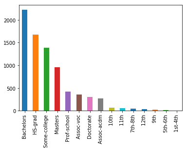
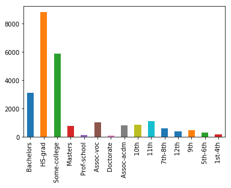
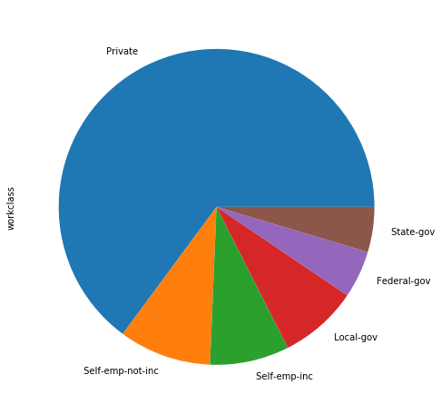
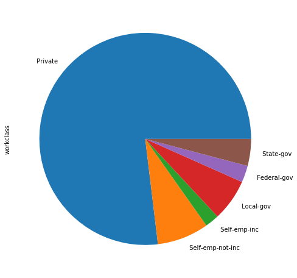
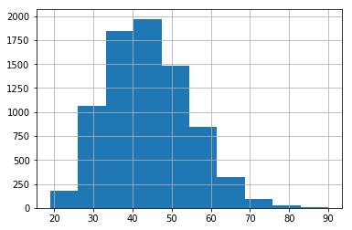
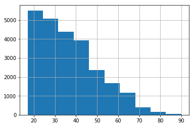

# Communicating Results
Let's see how we can communicate findings with visualizations with the census income data.


```python
import pandas as pd
%matplotlib inline

df_census = pd.read_csv('census_income_data.csv')
```

Let's create two dataframes to separate people who make above and below 50K.


```python
df_a = df_census[df_census['income'] == ' >50K']
df_b = df_census[df_census['income'] == ' <=50K']
```

We can use bar graphs to compare the education levels reached in both groups.


```python
ind = df_a['education'].value_counts().index
df_a['education'].value_counts()[ind].plot(kind='bar');
```





```python
df_b['education'].value_counts()[ind].plot(kind='bar');
```





Notice the same index was used to keep the labels of the bar charts in the same order. Next, let's plot pie charts to compare what workclasses dominate in each group.


```python
ind = df_a['workclass'].value_counts().index
df_a['workclass'].value_counts()[ind].plot(kind='pie', figsize=(8, 8));
```





```python
df_b['workclass'].value_counts()[ind].plot(kind='pie', figsize=(8, 8));
```





Next, let's use histograms to plot the distribution of ages for each group.


```python
df_a['age'].hist();
```





```python
df_b['age'].hist();
```





```python
df_a['age'].describe()
```


    count    7841.000000
    mean       44.249841
    std        10.519028
    min        19.000000
    25%        36.000000
    50%        44.000000
    75%        51.000000
    max        90.000000
    Name: age, dtype: float64


```python
df_b['age'].describe()
```


    count    24720.000000
    mean        36.783738
    std         14.020088
    min         17.000000
    25%         25.000000
    50%         34.000000
    75%         46.000000
    max         90.000000
    Name: age, dtype: float64


```python

```
