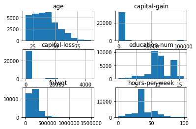
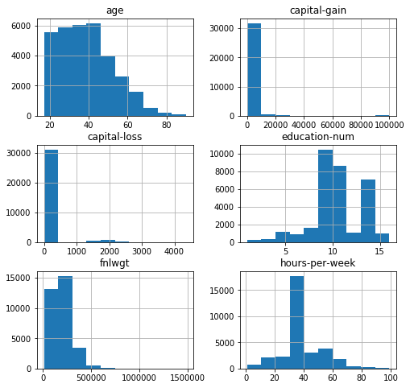
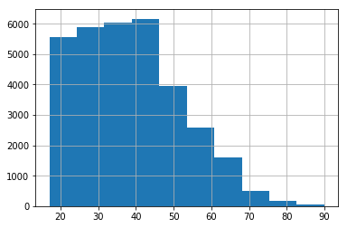
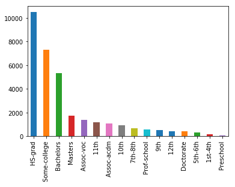
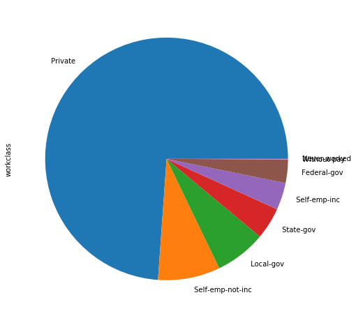
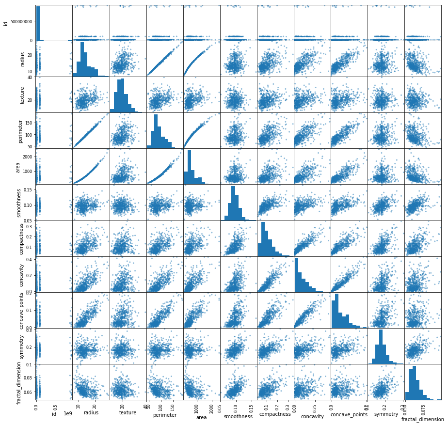
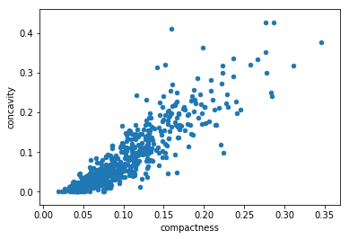

# Plotting with Pandas
Here are some of the most common and useful plots you can create with Pandas. Note that the plot methods on a Series or DataFrame are just simple wrappers around matplotlib functions. This is why you might see these them used interchangeably. Pandas is nice for quick insights, but you'll need to use matplotlib to really dive into details and customize your visualizations. We'll get into this more later on.

Let's first use census income data to practice plotting histograms, bar charts, and pie charts.


```python
import pandas as pd

# This allows us to view visualizations in Jupyter notebook - useful!!
%matplotlib inline

# View summary of census income data
df_census = pd.read_csv('census_income_data.csv')
df_census.info()
```

    <class 'pandas.core.frame.DataFrame'>
    RangeIndex: 32561 entries, 0 to 32560
    Data columns (total 15 columns):
    age               32561 non-null int64
    workclass         30725 non-null object
    fnlwgt            32561 non-null int64
    education         32561 non-null object
    education-num     32561 non-null int64
    marital-status    32561 non-null object
    occupation        30718 non-null object
    relationship      32561 non-null object
    race              32561 non-null object
    sex               32561 non-null object
    capital-gain      32561 non-null int64
    capital-loss      32561 non-null int64
    hours-per-week    32561 non-null int64
    native-country    31978 non-null object
    income            32561 non-null object
    dtypes: int64(6), object(9)
    memory usage: 3.7+ MB
    


```python
# This is quick way to view histograms for all numeric columns
df_census.hist()
```


    array([[<matplotlib.axes._subplots.AxesSubplot object at 0x000001E3BC0ECB70>,
            <matplotlib.axes._subplots.AxesSubplot object at 0x000001E3BBCBC278>],
           [<matplotlib.axes._subplots.AxesSubplot object at 0x000001E3BC3E35C0>,
            <matplotlib.axes._subplots.AxesSubplot object at 0x000001E3BC40AB38>],
           [<matplotlib.axes._subplots.AxesSubplot object at 0x000001E3BC43C0B8>,
            <matplotlib.axes._subplots.AxesSubplot object at 0x000001E3BC464630>]],
          dtype=object)





```python
# That was way too crowded, let's make our figure size bigger
# Also, we can use a semicolon to suppress unwanted output
df_census.hist(figsize=(8,8));
```





```python
# We can also get a histogram for a single column like this
df_census['age'].hist();
```





```python
# We can also plot a histogram using this more general function
df_census['age'].plot(kind='hist');
```


Next, let's plot a bar chart. For this, we need counts for each distinct value (or bar).


```python
# This function aggregates counts for each unique value in a column
print(df_census['education'].value_counts());
```

     HS-grad         10501
     Some-college     7291
     Bachelors        5355
     Masters          1723
     Assoc-voc        1382
     11th             1175
     Assoc-acdm       1067
     10th              933
     7th-8th           646
     Prof-school       576
     9th               514
     12th              433
     Doctorate         413
     5th-6th           333
     1st-4th           168
     Preschool          51
    Name: education, dtype: int64
    


```python
# We can use value counts to plot our bar chart
df_census['education'].value_counts().plot(kind='bar');
```





```python
# Value counts are also required for pie charts
df_census['workclass'].value_counts().plot(kind='pie', figsize=(8, 8));
```





Now, let's use cancer data to practice plotting scatter plots and box plots.


```python
df_cancer = pd.read_csv('cancer_data_edited.csv')
df_cancer.info()
```

    <class 'pandas.core.frame.DataFrame'>
    RangeIndex: 564 entries, 0 to 563
    Data columns (total 12 columns):
    id                   564 non-null int64
    diagnosis            564 non-null object
    radius               564 non-null float64
    texture              564 non-null float64
    perimeter            564 non-null float64
    area                 564 non-null float64
    smoothness           564 non-null float64
    compactness          564 non-null float64
    concavity            564 non-null float64
    concave_points       564 non-null float64
    symmetry             564 non-null float64
    fractal_dimension    564 non-null float64
    dtypes: float64(10), int64(1), object(1)
    memory usage: 53.0+ KB
    

This next function is really cool for getting quick insight into the relationships among numeric variables with scatterplots. It also displays a histogram for each variable.


```python
# Create scatter matrix, make figure size big enough to display clearly
pd.plotting.scatter_matrix(df_cancer, figsize=(15, 15));
```





```python
# Create a single scatter plot like this
df_cancer.plot(x='compactness', y='concavity', kind='scatter');
```





```python
# Create a box plot like this
df_cancer['concave_points'].plot(kind='box');
```


```python

```
